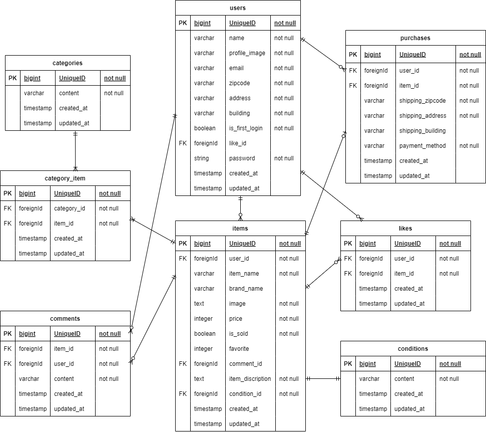

# フリマアプリ

## 環境構築

### Dockerビルド
- git clone git@github.com:coachtech-material/laravel-docker-template.git  
- docker-compose up -d --build 

### Laravel環境
- docker-compose exec php bash  
- composer install  
- .env.exampleファイルから.envを作成し、環境変数を変更  
- php artisan key:generate  
- php artisan migrate  
- php artisan db:seed  

## 使用技術
- PHP7.4.9
- Laravel8.83.8
- MySQL8.0.26

## 開発環境
- トップ画面：http://localhost/
- ユーザー登録　http://localhost/register
- phpMyAdmin：http://localhost:8080/

## ER図

